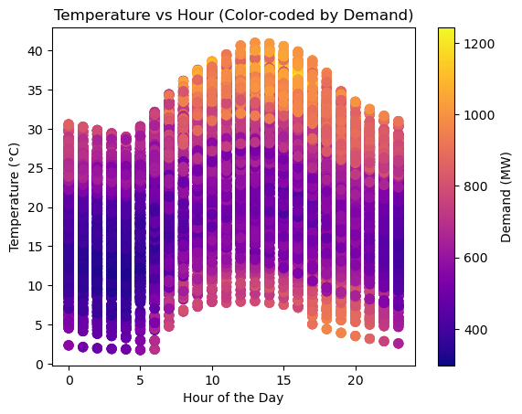

In this current post, we go into the exploration and analysis of various regression machine learning methods. Our objective is to utilize a range of machine learning techniques to forecast the load demand of the Cyprus power system.

In the initial phase, the 'data' dataframe include all essential features and measurements spanning a 16-month period. Throughout the analysis, our focus is directed towards two important features: temperature and hour. While incorporating additional features could potentially enhance result accuracy, for code explanation and methodology simplification, we have opted to retain only these two key features.

```
import matplotlib.pyplot as plt
import numpy as np

# Create a scatter plot with demand as color
plt.scatter(data['hour'], data['T2M'], c=data['Demand'], cmap='plasma', s=50)

# Add colorbar
cbar = plt.colorbar()
cbar.set_label('Demand (MW)')

# Set labels for axes
plt.xlabel('Hour of the Day')
plt.ylabel('Temperature (°C)')

plt.title('Temperature vs Hour (Color-coded by Demand)')

plt.show()
```



The first analysis illustrates the fluctuation of demand in megawatts (MW) in response to variations in temperature and hour. In instances of low demand, the figure showcases a darker color, transitioning to brighter hues as demand increases.

**Data's preparation**

Prior to normalizing the data, it's crucial to recognize that the 'hour' feature is cyclical. A detailed analysis on handling cyclical features has been discussed in a previous post, accessible [here](/blog/handling-cyclical-features-for-use-in-method-such-us-machine-learning/). Furthermore, the guidance on scaling data developed in other post [here](/blog/feature-scaling/), Normalisation and Standardisation method implemented. Moreover, the data's was divided into test and training data.

```
from sklearn.preprocessing import StandardScaler
sc=StandardScaler()
data.loc[:,['hour_sin','hour_cos','T2M_norm']]=sc.fit_transform(data.loc[:,['hour_sin','hour_cos','T2M']])

from sklearn.model_selection import train_test_split
X_train, X_test, y_train, y_test = train_test_split(X, y, test_size = 0.2, random_state = 0)
```

**Assessing Machine Learning Regression Models: RMSE and R-squared Evaluation**

When it comes to checking how well a machine learning regression model is doing, we use two important measures: RMSE and R-squared. RMSE looks at the average difference between the predicted values and the actual values. If the RMSE is low, it means the model is doing a good job. R-squared, on the other hand, tells us how much of the variability in the data our model can explain. A higher R-squared is better, showing that the model fits the data well. So, by looking at both RMSE and R-squared, we can figure out if our regression model is accurate and how well it explains the data.

```
from sklearn.metrics import r2_score
from sklearn.metrics import mean_squared_error
# Calculate RMSE
rmse = np.sqrt(mean_squared_error(y_test, X_test[:,5]))

# Calculate R-squared
r_squared = r2_score(y_test, X_test[:,5])

print(f'RMSE: {rmse}')
print("R-squared:", r_squared)
```

Current TSO's demand forecast accuracy: RMSE= 30.194821557544707 , R-squared= 0.9700502334373836

**1. Multiple Linear Regression**

Multiple Linear Regression is a statistical technique that helps us make predictions by analyzing the relationships between multiple variables. Imagine you have a dataset with one outcome you want to predict (let's call it 'Y') and several factors that might influence it (let's call them 'X1,' 'X2,' etc.).

**Multiple Linear Regression:**

$$
Y = b_0 + b_1X_1 + b_2X_2 + \ldots + b_kX_k
$$

The goal is to find the best values for b0,b1,…,*bk* that minimize the difference between our predicted *Y* and the actual *Y* in our dataset. Once we find these values, we can use them to make predictions. For example, if we want to predict someone's weight (*Y*), we'd use their height (X1), age (X2), and other relevant factors. The coefficients (*b*0,*b*1,…,*bk*) tell us how much *Y* is expected to change for a one-unit change in each *X* variable, holding other variables constant. A positive coefficient means an increase in *Y* with an increase in the corresponding *X*, and a negative coefficient means the opposite.

**Implementation of *Multiple* Linear Regression**

```
# Training the Simple Linear Regression model on the Training set
from sklearn.linear_model import LinearRegression
MLR = LinearRegression()
MLR.fit(X_train[:,:3], y_train)

# Predicting the Test set results
y_predMLR = MLR.predict(X_test[:,:3])

from sklearn.metrics import r2_score
from sklearn.metrics import mean_squared_error
# Calculate RMSE
rmse = np.sqrt(mean_squared_error(y_test, y_predMLR))

# Calculate R-squared
r_squared = r2_score(y_test, y_predMLR)

print(f'RMSE: {rmse}')
print("R-squared:", r_squared)
```

**2. Polyonimial Regression**

Polynomial regression focuses on capturing nonlinear patterns by introducing higher-degree polynomial terms of a single independent variable. Polynomial regression is particularly useful when the relationship between the variables is nonlinear, providing a more accurate fit to the data compared to the linear assumptions of multiple linear regression.

**Polynomial Regression:**

$$
Y = b_0 + b_1X + b_2X^2 + \ldots + b_nX^n
$$

**Implementation of Polyonimial Regression**

```
from sklearn.preprocessing import PolynomialFeatures
from sklearn.linear_model import LinearRegression
from sklearn.pipeline import make_pipeline

# Assuming X_train is your feature matrix with 3 columns, and y_train is your target variable

# Create a polynomial regression model with degree 2 (you can change the degree as needed)
degree = 2
PR = make_pipeline(PolynomialFeatures(degree), LinearRegression())

# Train the model
PR.fit(X_train[:,:3], y_train)

# Make predictions
y_predPR = PR.predict(X_test[:,:3])

from sklearn.metrics import mean_squared_error
# Calculate RMSE
rmse = np.sqrt(mean_squared_error(y_test, y_predPR))

# Calculate R-squared
r_squared = r2_score(y_test, y_predPR)

print(f'RMSE: {rmse}')
print("R-squared:", r_squared)
```

**Implementation Support Vector Regression**

```
# Training the SVR model on the whole dataset
from sklearn.svm import SVR
SVR = SVR(kernel = 'rbf')
SVR.fit(X_train[:,:3], y_train)

# Predicting a new result
y_predSVR=SVR.predict(X_test[:,:3])

print(np.concatenate((y_predSVR.reshape(len(y_predSVR),1), y_test.reshape(len(y_test),1)),1))
from sklearn.metrics import mean_squared_error
# Calculate RMSE
rmse = np.sqrt(mean_squared_error(y_test, y_predSVR))
# Calculate R-squared
r_squared = r2_score(y_test, y_predSVR)

print(f'RMSE: {rmse}')
print("R-squared:", r_squared)
```

**Implementation Disicion Tree Regression**

```
# Training the Decision Tree Regression model on the whole dataset
from sklearn.tree import DecisionTreeRegressor
DTR = DecisionTreeRegressor(random_state = 0)
DTR.fit(X_train[:,:3], y_train)
# Predicting a new result
y_predDTR=DTR.predict(X_test[:,:3])
from sklearn.metrics import mean_squared_error
# Calculate RMSE
rmse = np.sqrt(mean_squared_error(y_test, y_predDTR))
# Calculate R-squared
r_squared = r2_score(y_test, y_predDTR)
print(f'RMSE: {rmse}')
print("R-squared:", r_squared)
```

**Implementation Random Forest Regression**

```
# Training the Random Forest Regression model on the whole dataset
from sklearn.ensemble import RandomForestRegressor
RFR = RandomForestRegressor(n_estimators = 10, random_state = 0)
RFR.fit(X_train[:,:3], y_train)
# Predicting a new result
y_predRFR=RFR.predict(X_test[:,:3])
from sklearn.metrics import mean_squared_error
# Calculate RMSE
rmse = np.sqrt(mean_squared_error(y_test, y_predRFR))
# Calculate R-squared
r_squared = r2_score(y_test, y_predRFR)
print(f'RMSE: {rmse}')
print("R-squared:", r_squared)
```

**Results**

|  | TSO's Forecast | Multiple Linear Regression | Polyonimial Regression | Support Vector Regression | Disicion Tree Regression | Random Forest Regression |
| --- | --- | --- | --- | --- | --- | --- |
| RMSE | 30.2 | 109.9 | 63.1 | 59.7 | 27.3 | 29.4 |
| R-Squared | 0.970 | 0.603 | 0.869 | 0.883 | 0.976 | 0.972 |

Your thoughts and questions are important for me. Feel free to share your insights or inquire about anything in the comments section below. Let's keep the conversation going!
