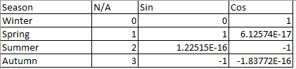
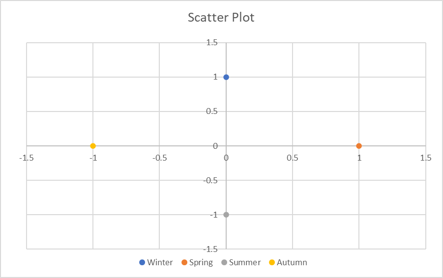
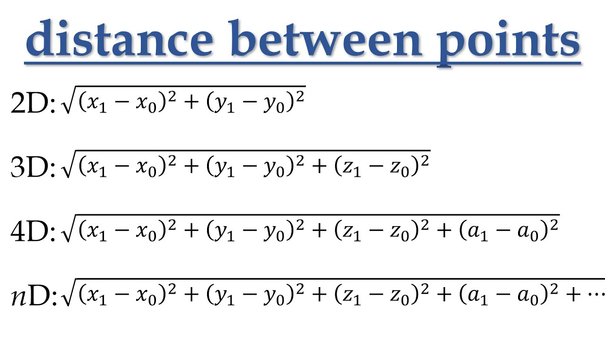
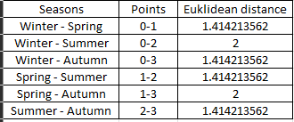

Often in situations of use machine learnings methods, we have to consider how to handle the cyclic features. For example in K-Means algorithm it use Euclidean distance in order to sort the available data's in clusters. In this situations the distance between the hour 0 (00:00) from 23 (23:00) is bigger than what really is. Base on the literature in order to overcome this problem they are use the sin and cosine method to represent each hour in a different cyclic form. With the help of [Sefidian Academy ](https://www.sefidian.com/)and his corresponding article [1] about [handling cyclical features](https://www.sefidian.com/2021/03/26/handling-cyclical-features-such-as-hours-in-a-day-for-machine-learning-pipelines-with-python-example/) i will try to analytical explain the method and with a simple example i will represent how this help in distance measures. 

**Equations**

$$
\begin{align*}
x &= \sin\left(\frac{a \cdot 2\pi}{\max(a) + 1}\right) \\
y &= \cos\left(\frac{a \cdot 2\pi}{\max(a) + 1}\right)
\end{align*}
$$

Base on the above equations we transform real values to a new cyclical form. So, lets think a simple cyclical problem of seasons values and try to solve it for the proof of operation. If we declare the seasons Winter, Spring , Summer and Autumn to a number value it will be 0,1,2 and 3 corresponding. As we know after Autumn the next season is the winter but a distance of 3 (3-0) is the maximum that can occur in our problem if we use the declared number values. After the implementation of transform we have the following form of datas:

Now let's try to represent the above data's in x and y axes of scatter plot (x_axes=Sin , y_axes=Cos) : 

Finally, how does this help in K-Means algorithm and other distance methods that i will use ? Euclidian distance calculated based on the below formulas.

In our simple problem there are 2D points and after applying the formulas the distance is the following:

So is this Euclidean distance true? if we think the reality this represent exactly how far is each season for each other.

Your thoughts and questions are important for me. Feel free to share your insights or inquire about anything in the comments section below. Let's keep the conversation going!

**References:**

[1] : [https://www.sefidian.com/2021/03/26/handling-cyclical-features-such-as-hours-in-a-day-for-machine-learning-pipelines-with-python-example/](https://www.sefidian.com/2021/03/26/handling-cyclical-features-such-as-hours-in-a-day-for-machine-learning-pipelines-with-python-example/)
