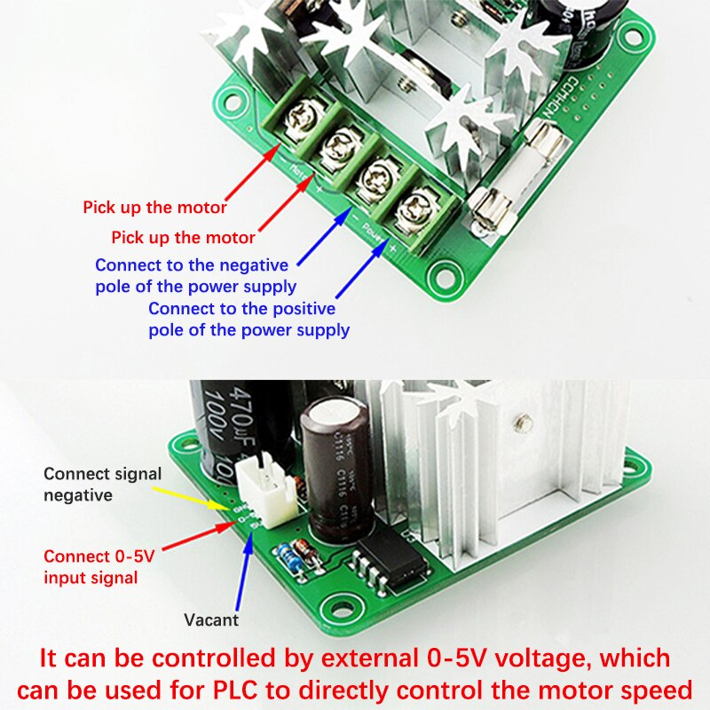

A lot of DIY projects need a programmable microcontroller to control the operation of it. In the current article we will discuss a suitable industrial module to control a dc motor speed. The following article is my inspiration after i am trying to building a small project that need to connect Arduino with motor controller to control the speed. 

Base on my personal experience I have bought the following controller: [Aliexpress](https://www.aliexpress.com/item/1005003949611503.html?spm=a2g0o.productlist.main.1.e4b0336ffjH8Z4&algo_pvid=c49e8908-e869-48b3-85b9-7ba90d3e744c&algo_exp_id=c49e8908-e869-48b3-85b9-7ba90d3e744c-0&pdp_npi=4%40dis%21EUR%214.24%213.61%21%21%2132.74%21%21%40211b88f116933178415294040e0203%2112000027540721041%21sea%21CY%21941457139%21&curPageLogUid=JmzG6szt1JpA)

If the above link is not available any more you can find similar controller by keyword CCMHCN 



With this type of controller, you can use PWM Arduino output or some other microcontroller output and control the yellow and red signal from the above image. In the other side of controller you have to connect the motor and the power supply. If we assume that the power supply nominal voltage was 12V, this mean that the 5v input signal gives 12v output signal and 2.5v input signal gives 6v output signal and so on. 

In the following code an example of use Arduino to test the operation of the controller is represent. Using serial communication you can give a range of values between 0-10 and it will transform from 0 to 255 PWM output which is 0-5v. 

```
#include "MapFloat.h" //Library Source: https://github.com/radishlogic/MapFloat
float PWMVal = 0;        
const int pinOut = 3; // PWM Pin of Arduino Nano         

void setup() {
  Serial.begin(9600);
}

void loop() {
  while (Serial.available()>0){
  String myString = Serial.readString(); // Read as String
  float myFloat = myString.toFloat();   // Convert it to float
  float PWMVal = mapFloat (myFloat, 0,10.0,0,255); // 0->0 , 10->255
  analogWrite(pinOut, PWMVal);        // Output
  Serial.print("LEVEL = ");
  Serial.println(myFloat);           
  Serial.print ("PMW VALUE = ");
  Serial.println (PWMVal);
  Serial.println("----------------------------");
  }
}
```
